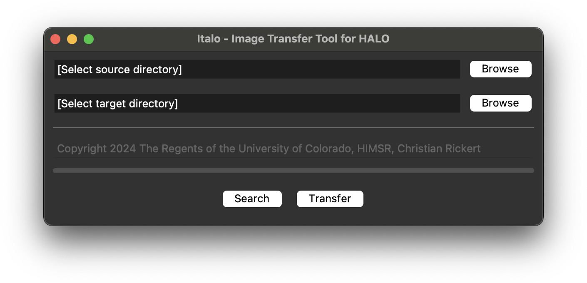

# Italo
Image transfer tool for Indica Labs' HALO  🤌

>[!TIP]
>Italo requires access to HALO's GraphQL API server with a `scope=serviceuser|graphql` service client. For details on how to create the HALO service client, please see [Step 2](https://gitlab.com/indica_labs_public/example-code#step-2-create-halo-service-client) of Indica Labs' python example. In short, run the following command from an elevated Windows Command Prompt ("Run as adminstrator") on the HALO server system to request a new service client named `Italo`:
>```terminal
>"C:\Program Files\Indica Labs\Identity Provider\IndicaLabs.ApplicationLayer.Halo.IdentityProvider.exe" reconfigure --script AddResearchServiceClient "client_type=Italo;scopes=serviceuser|graphql"
>```
>The configuration details required for Italo to communicate with HALO's GraphQL API server can then be found on the HALO server system with the Identity Provider's config file:
>
>`C:\ProgramData\Indica Labs\Configuration\IndicaLabs.ApplicationLayer.Halo.IdentityProvider\local-production.yml`
>```YAML
>  - !OidcClient/ClientCredentials
>    id: [GraphQL client name]
>    scopes:
>    - serviceuser
>    - graphql
>    require_client_secret: true
>    secrets:
>    - secret: [GraphQL client secret]
>```
>Notice: The `[GraphQL client name]` is composed of the service client name `Italo`, an underscore `_`, and the `[GraphQL server name]`.

>[!WARNING]
>Upon first start, press the `Search` button. Italo will then write a template configuration file named `secrets.json` to the current folder. Replace the values indicated by squared brackets `[ ]` with your custom configuration values:
>```JSON
>{
>  "client_name": "[GraphQL client name]",
>  "client_secrect": "[GraphQL client secret]",
>  "client_scope": "serviceuser graphql",
>  "grant_type": "client_credentials",
>  "server_name": "[GraphQL server name]"
>}
>```
>**Make sure to _limit access_ to the `secrets.json` file to people you trust with modifying HALO's SQL database.**

>[!CAUTION]
>Modifying entries in a database or copying files between storage systems bears the risk of unexpected behaviour and failures. HALO's SQL database reports errors upon failing transfer requests, and Italo only **copies** files without modification of the source or the target: However, you should use stable network connections (ethernet > wifi) and avoid tunneling protocols (vpn) to improve your user experience. If the connection to the server times out (progress bar stops), simply hit "Search" and "Transfer" again to continue.
